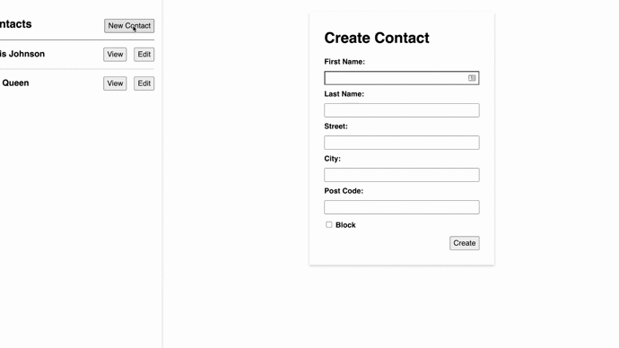

# React Address Book

In this exercise you are going to practice `fetch` and `CRUD` with a large form and multiple endpoints.

Some of the components have been created for you.

## Setup

1. Fork this repository
2. Clone the forked repository onto your local machines
3. In the root directory, type `npm install`, which installs dependencies for the project
4. Finally, type `npm run start`, which starts a development server that runs your website in the browser. That server will reload your website whenever you make any changes to source files

## Deliverables

- A user can **create a contact** via a form when the "New Contact" button is clicked
	- The created contact should have:
		- first name
		- last name
		- street
		- city
		- post code
		- an option to block the contact
	- The created contact should be saved in the database
	- The created contact should be added to the contacts list

## Instructions

- Open a terminal and run this command in the project directory `json-server --watch db/db.json --routes db/routes.json`
- Look for `[TODO] Write Code` for hints on where you need to write code
- Write a `useEffect` for a "GET" request from the server
- Write form handlers for the `CreateContactForm` inputs
- Write a `handleSubmit` for the form
- Write a "POST" request for the `/contacts` endpoint
- Write a "POST" request for the `/addresses` endpoint

## Tips

- Check `db/db.json` and think about which URLs you are going to need when creating your `fetch` functions.
- Use `state` to keep track of changes and render the UI.
- **When writing the "POST" requests you need to do one before the other, look at `addressId` in `contacts` to figure it out!**

## Extra Challenges

- A user can **edit a contact** via a form when the "Edit" button is clicked
	- The updated contact should be saved in the database
	- The updated contact should be viewable in the UI
	- The selected contact can also be deleted from the **edit contact** form
- When a user submits a form they should be redirected to see the changes
	- Use a `ContactView` component to do this.